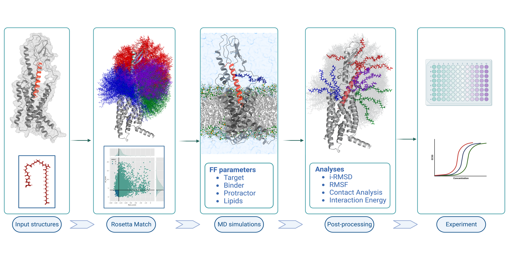

# Structure-based computational scanning of chemical modification sites in biologics

Welcome to the GitHub repository dedicated to supporting the simulations for our recent manuscript on "Structure-based computational scanning of chemical modification sites in biologics". This repository contains all the necessary input files and resources required to replicate the computational workflow outlined in our study.

## Abstract:

In our manuscript, we explore the enhancement of peptide and protein-based drugs through fatty acid derivatization—a chemical modification that can extend drug half-life, minimize immunogenicity, and refine drug delivery and uptake. Traditional methods for creating these modified therapeutics are often labor-intensive and result in products that may be unstable, inactive, or heterogenous. To overcome these challenges, we have introduced a novel hybrid computational approach that leverages the Matcher protocol from the Rosetta suite and molecular dynamics simulations. This method is designed to streamline the synthesis of chemically modified biologics, allowing for the precise tuning of their properties.

The repository serves as a toolkit for researchers and scientists interested in applying our workflow to their own projects. By using the provided input files, users can embark on the journey of designing optimized peptide therapeutics with fatty acid modifications, as well as extend the methodology to a wide array of chemically modified drugs.

Within this repository, you will find:

`bin`: This directory contains the foundational python scripts used to run the Rosetta Matcher Protocol.  

`nnprotscan`: It contains the supporting python scripts used for Matcher Protocol and MD simulations. It contains the necessary scripts to run an MD simulation of genertic protein-in-solution system with protracted proteins. 

`paper`: This directory contains all necessary scripts including running MD and post-processing MD simulation trajectories and jupyter notebooks. 

## Prerequisites:

In order to excecute this workflow, the user would require Rosetta, GROMACS, and OpenMM to be installed in the system. Furthermore, the associated conda environment also needs to be created and activated for running the workflow and analyze the results. 

Rosetta software requires license. The software and the license can be obtained from https://www.rosettacommons.org.

GROMACS and OpenMM are freely available and can be obtained from https://www.gromacs.org and https://openmm.org respectively.

To download the repository:

`git clone https://github.com/novonordisk-research/nnprotscan.git`

To create the conda environment:

`cd nnprotscan`

`conda env create -f environment.yml`

Activate the conda environment:

`conda activate nnprotscan`

## Example Run:

We have provided the necessary scripts for running this workflow in the paper directory. 

Go to the glp1-matcher directory to execute the Rosetta Matcher protocol:

`cd paper/glp1-matcher` 

`sbatch scan_job.sh`

Generate the conformations for MD simulation:

`python ../../bin/get_mdsim_conformers.py path_to_matcher --chain A --linkage amide --output output_path_to_save_conf `

To run MD simulations of the examples:

`cd ../glp1-md`

`bash protein_preparation.sh path/to/target/directory path/to/pdb/directory starting_atom_ID/for/mutating/residue ending_atom_ID/for/mutating/residue`

**CAUTION:** The above command would initialize independent MD simulations of every input structures, present in the `output_path_to_save_conf` directory. Each simulation uses a GPU. Therefore, the user should be careful in managing the computational resources prior to running this script.

## Protein-in-Solution:

In addition to the scripts needed for the example run, we have also provided the scripts required to run MD simulations of any generic protein-in-solution system with protracted residue. The necessary files are provided in the directory `nnprotscan/protein-in-solution`

We encourage you to explore the repository, utilize the resources provided, and contribute to the advancement of drug discovery through computational design. If you encounter any issues or have questions regarding the workflow, please feel free to open an issue or contact the repository maintainers.

Thank you for your interest in our work, and we look forward to seeing the innovative ways in which the scientific community will apply these tools to accelerate the development of new therapeutics.
